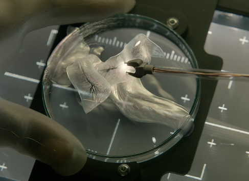

  

- Projeto da faculdade Algorítmo Genético. 2017

O problema:

Em um mapa 2d permitir o deslocamento de um individuo do ponto A para o ponto B.
Possuindo um obstaculo de fenda já estabelecido pelo sistema. 
Estabelecer uma coordenada de deslocamento aplicando tecnicas de algoritmo genético.

Ao executar o programa é possível ver convergindo para o melhor individuo.

---

Bloco Partida: 1x1 \
Bloco objetivo: 1000x1000 \
Obstáculos:1 até 400 no eixo Y (coluna)
           402 até 701
           404 até 1000
    
portanto o programa cria um mapa
com duas fendas de passagem

os genes representam a locomoção do individuo nas direções:

[direita, baixo, direita, baixo]
